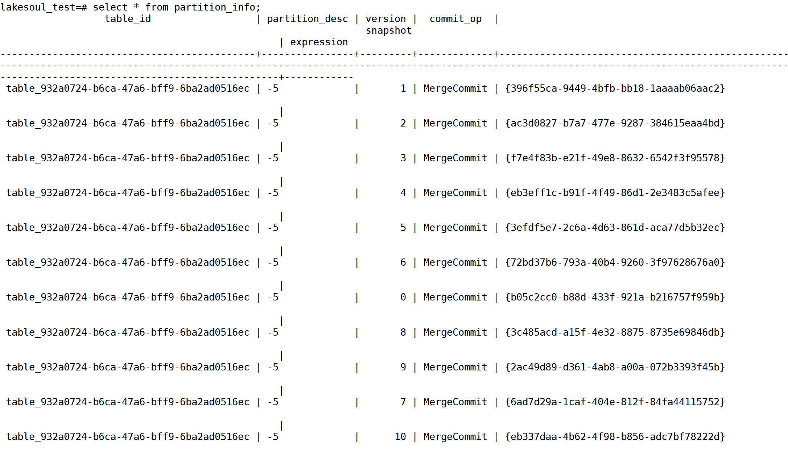

# 赛题背景

## 赛题名

数据湖流批一体性能优化

## 赛题背景
湖仓一体、流批一体已经成为大数据新一代架构范式。通过在数据湖存储上构建数仓表存储，并支持流批一体写入，能够大幅简化大数据架构、开发流程以及部署运维开销，降本增效。业内涌现出 DeltaLake、Iceberg、Hudi 等数据湖存储框架。而 LakeSoul 作为国产唯一湖仓表存储框架，在元数据扩展性、并发性和数据实时更新能力上有着全新的设计实现和性能优势，也吸引了业内的广泛关注。
 湖仓存储框架的流批一体读写性能，是非常重要的指标，关系到数据能否快速、准确的摄入到湖仓之中，并做高效的数据处理分析。而数据湖通常使用计算存储分离的设计，并且需要支持多种计算框架、支持对象存储等，给读写性能优化带来很大的挑战。

## 赛题任务

给定数据集，使用 Spark 计算框架（版本 3.1.2），以多个批次的方式模拟流式、并发写入，所有数据写入完毕后全量读取出来。最终评估完整的写入、读取效率，换算为 行数/core/s 作为评价指标。
 参赛选手可以在 LakeSoul、Iceberg、Hudi 这几个数据湖存储框架中选择一个，可以在保证数据正确性的前提下，通过调优参数、优化代码的方式来优化性能，提升写入速度。最终通过评测参赛方案的读写性能和方案实现的创新性来决定排名。

## 赛题链接

[数据湖流批一体性能优化 竞赛 - DataFountain](https://www.datafountain.cn/competitions/585)

# 运行方法

## 目录结构

    |-- code
        |-- ccf-bdci2022-datalake-contest
            |-- src/main/scala
                |-- org
                        |-- ccf/bdci2022/datalake_contest
                            |-- Read.scala
                            |-- Write.scala
                        |-- apache.spark.sql.lakesoul(lakeSoul部分更改的源码)
                |-- com.dmetasoul.lakesoul(lakeSoul部分更改的源码)
                |-- tools (工具类）
                |-- mergeTools (自定义Operator)
        |-- pom.xml
        |-- build.sh
        |-- README.md
        |-- imags

## Build
在code目录执行

    bash build.sh

可在code目录下获得submit.zip

# 赛题方案

## 数据集

### 概览
11个parquet文件

| 文件名             | 类型      | 压缩格式 | 大小    | 条数       | rowGroups数 |
|-----------------|---------|------|-------|----------|------------|
| base-0.parquet  | parquet | 未压缩  | 900MB | 10000000 | 1          |
| base-1.parquet  | parquet | 未压缩  | 179MB | 2000000  | 1          |
| base-2.parquet  | parquet | 未压缩  | 179MB | 2000000  | 1          |
| base-3.parquet  | parquet | 未压缩  | 179MB | 2000000  | 1          |
| base-4.parquet  | parquet | 未压缩  | 179MB | 2000000  | 1          |
| base-5.parquet  | parquet | 未压缩  | 179MB | 2000000  | 1          |
| base-6.parquet  | parquet | 未压缩  | 179MB | 2000000  | 1          |
| base-7.parquet  | parquet | 未压缩  | 179MB | 2000000  | 1          |
| base-8.parquet  | parquet | 未压缩  | 179MB | 2000000  | 1          |
| base-9.parquet  | parquet | 未压缩  | 179MB | 2000000  | 1          |
| base-10.parquet | parquet | 未压缩  | 179MB | 2000000  | 1          |
| base-11.parquet | parquet | 未压缩  | 179MB | 2000000  | 1          |

### 分析

- 每个文件均只包含一个rowGroup，导致读取时虽然可通过参数设置单个切分策略，但只会有一个task读取整个文件，其余task读空
- 经实验，使用snappy压缩，压缩率并不高
- 0号大文件900MB，其余的1-10号文件均为180MB，约5倍差距

## 写任务
1) 创建lakeSoul表，uuid作为主键，分区数量为4或8
2) 通过修改源码使得提交时支持自定义时间戳进行读时合并而不用考虑提交顺序，以及对仅对大文件repartition提供并行度而小文件直接写
2) 遍历所有文件路径集合构建读取文件并Upsert的FutureList
4) 遍历FutureList Await完成

## 读任务
1) 注册Operator
2) 按version合并元数据表partition_info中的多次upsert的快照集合
3) 读时合并，未指定Operator的采用默认DefaultMergeOp，合并规则为取最后一个

## 关键源码修改点
### com.dmetasoul.lakesoul.tables.LakeSoulTable

upsert时可提供一个自定义时间戳传参

    def upsert(source: DataFrame, userDefinedTimestamp: Long): Unit = {
        executeUpsert(this, source, "", userDefinedTimestamp)
    }

### com.dmetasoul.lakesoul.tables.execution.LakeSoulTableOperations

executeUpsert方法中LakeSoulUpsert对象提供一个额外的userDefinedTimestamp成员传给PreprocessTableUpsert

    val upsert = LakeSoulUpsert(
      target,
      source,
      condition,
      if (shouldAutoMigrate) Some(finalSchema) else None,
      userDefinedTimestamp)

### org.apache.spark.sql.lakesoul.commands.UpsertCommand
1) 优化写文件:在canUseDeltaFile时，增加是否通过repartition增加write的并行度的判断，由于本方案已并行并充分利用CPU核数，
故仅对0号900MB大文件依据uuid进行repartition，通过实验，分成8个分区得到较稳定结果。其余1-10号文件均直接写入即可，节省shuffle时间
由UI可见，其余的小文件均未进行shuffle

2) 给写文件的返回值Seq[DataFileInfo]设置自定义时间戳作为partition_info的元数据commit

    val newFiles = tc.writeFiles(df)
    newFiles.foreach(_.setModification_time(userDefinedTimestamp))
    tc.commit(newFiles, Seq.empty[DataFileInfo], userDefinedTimestamp = userDefinedTimestamp)

### org.apache.spark.sql.lakesoul.TransactionalWrite
优化写文件:由于压缩率较低,在写入时采用不压缩的格式，节约读时的解压时间，经过实验取得了更好的效果

### org.apache.spark.sql.lakesoul.TransactionCommit
变更元数据表写入内容：
commit方法新增传参userDefinedTimestamp，默认值为-1

由传入的自定义时间戳替代原来系统时间时间戳

    add_file_arr_buf += DataCommitInfo(
        tableInfo.table_id,
        range_key,
        addUUID,
        commit_type,
        //此处修改为自定义时间戳System.currentTimeMillis(),
        userDefinedTimestamp,
        changeFiles.toArray
    )
### com.dmetasoul.lakesoul.meta.DBManager
修改DBManager的commitData方法，commitOp.equals("MergeCommit")时，
1) 删除curSnapshot.addAll(partitionInfo.getSnapshot())，使得一次提交的元数据仅保留当前快照号，不再继承之前的所有快照构成集合
2) 使得提交的version不再是自增值，而是使用curPartitionInfo在TransactionCommit时设置的自定义时间戳（版本号）
得到如下图效果

### tools.MergePartitionInfoTable
合并元数据表partition_info中的多次upsert的快照列表
1) 根据table_id读表partition_info
2) 根据version升序排序
3) 按照排序顺序合并多次upsert的快照成一个集合
4) 将合并结果写入partition_info表 version=999

读时merge时会按合并后的快照顺序进行merge

## 优化思考过程

面对此赛题，经过了以下几个思考步骤：

### ①数据湖选型
我们使用hudi、iceberg及lakeSoul分别对此赛题进行初步适配后，通过多次实验，从使用难度到性能等多方面角度考量后，选择了lakeSoul作为本次方案的基础。

### ②合并策略选择
laekSoul提供Merge On Read及Copy on Write两种合并策略。由于本赛题是多次写入后进行一次读取，故MOR更加适合本赛题场景拥有更好的性能，故选择MOR并以UUID作为主键。

### ③并行
通过实验发现所提供的parquet文件数据集均只拥有一个rowGroup，导致读取一个文件时即使设置了分割文件的参数且也产生了多个task读取，但根据parquet读取的源码，

仅有在拥有rowGroup中点task读取全部数据，而其他task读取数据量为空
该问题可见：https://blog.csdn.net/monkeyboy_tech/article/details/122804011

此时影响了读取文件的并行度，尽管S3带宽有限，但一个task并不能获取全部带宽资源。考虑并行多个文件读取以充分利用带宽资源

故此时考虑通过同步或者异步。

异步可以充分控制读取文件顺序，简单的同步只能保证任务提交到线程池的顺序并不能保证完成时间的顺序，导致upsert的乱序。

经过尝试，我们考虑通过传入自定义时间戳更改元数据表，让同步的任务即使乱序upsert也可以在Read任务时merge到正确结果

### ④写文件的优化
在写入时，lakeSoul源码为提高写文件的并行度，对DS按照分区数量重分区后再进行写文件。但我们实现并行执行任务后，由于excuter数量有限 ，

小文件可能并不再需要repartition来提供并行度从而节省shuffle时间，而大文件通过重分区拆分成多个写文件任务，故我们考虑提供一个开关，
让使用者可以根据对文件大小的判断，自行决定是否在本次upsert进行repartition

### ⑤参数调优
对shuffle，s3有关参数，文件块大小，序列化，内存分配等参数进行调优，理论与实践进行结合，获得较优参数

例如:
1) 序列化方式采用KryoSerializer，对案例类dataLakeTable进行注册，节省较长完整类名所占空间

        .config("spark.serializer", "org.apache.spark.serializer.KryoSerializer")
        .config("registerKryoClasses", "tools.dataLakeTable")
2) 考虑shuffle方式。由于是spark3.X版本，hash shuffle已废弃。故通过sort shuffle设置阈值通过bypassMergeThreshold模式避免map端排序，
钨丝计划的tungsten-sort shuffle经实验效果不太好。
3) 考虑FileOutputCommitter版本选择2，此时commitTask执行的时候，会调用mergePaths方法直接将Task生成的数据从Task临时目录移动到程序最后生成目录

## 核心创新点
在lakeSoul数据湖源码的基础上，提供自定义Upsert版本号接口，使得即使在upsert操作没有在既定的顺序执行的情况下，

依然可以在读表的时候（MOR)根据自定义的版本号进行符合预期的merge。脱离了UPSERT需要固定执行顺序的束缚后，我们可以解决很多场景问题，例如：

1) 并行场景。用户可以轻易的使用并行同步执行UPSERT而不用考虑多线程情况下执行顺序混乱的问题，以进行性能调优（即本方案需要解决的问题）
2) 补数场景。对于有需要按顺序merge的一批数据源，在数据不全时可以先行upsert已有数据源而不用等待全部数据源再按顺序依次upsert，之后再进行补数。
如已经有1，2，3，6，7号的数据源，在4与5号缺失的情况写可以先对已有的数据源进行upsert，等到拥有4，5数据源时再进行upsert补充，读时依然可以merge到预期结果。

# 实验结果

可见读写时间都拥有较高的效率
